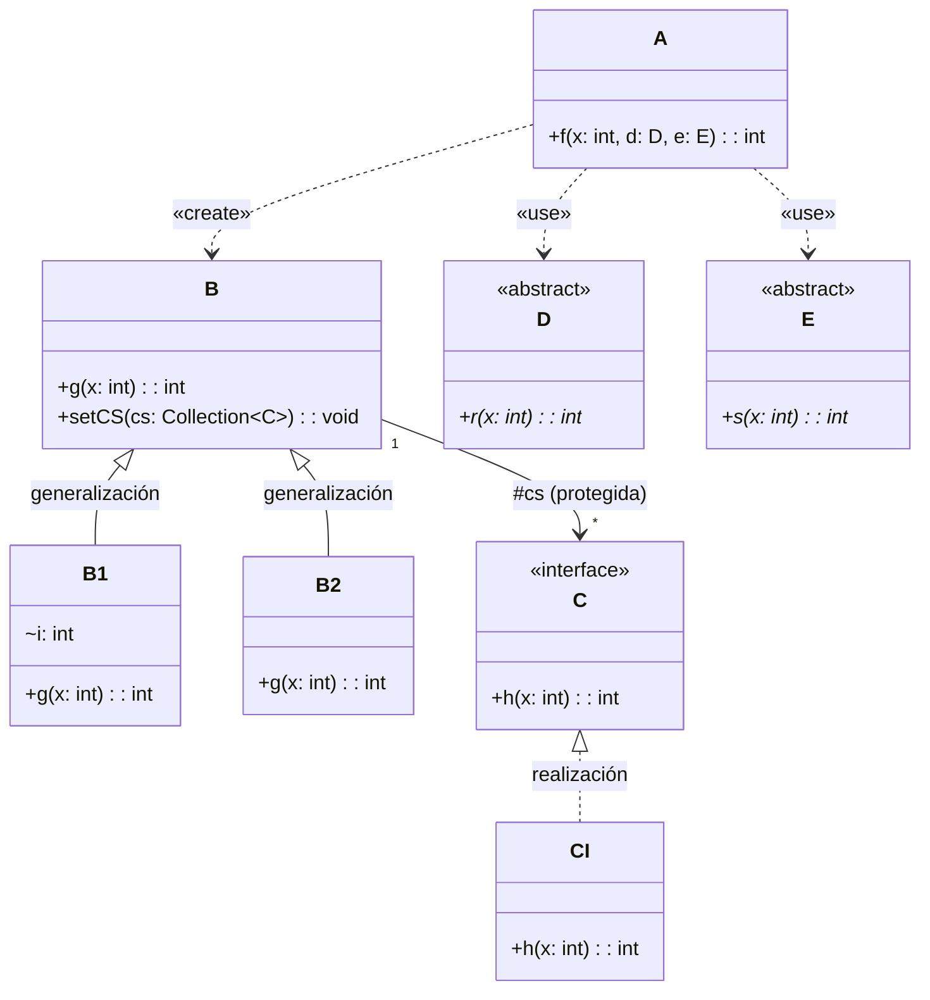
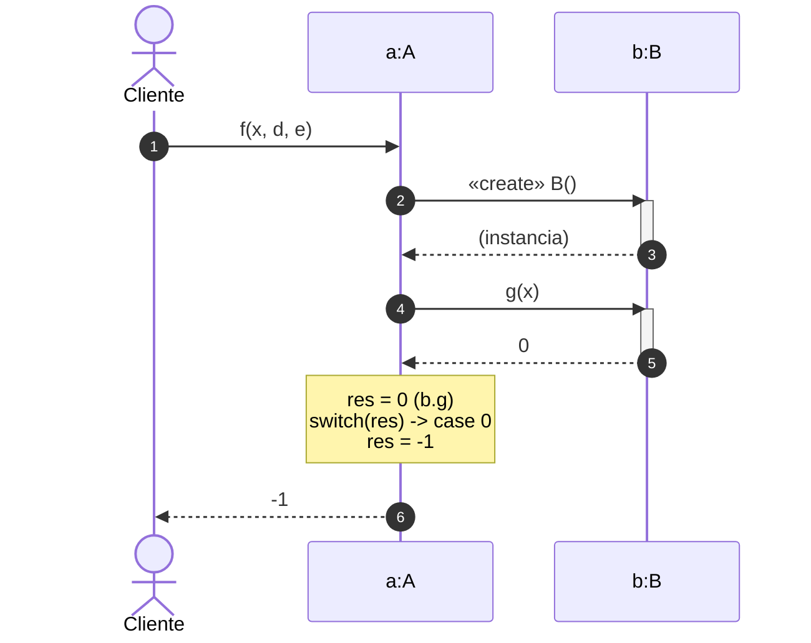
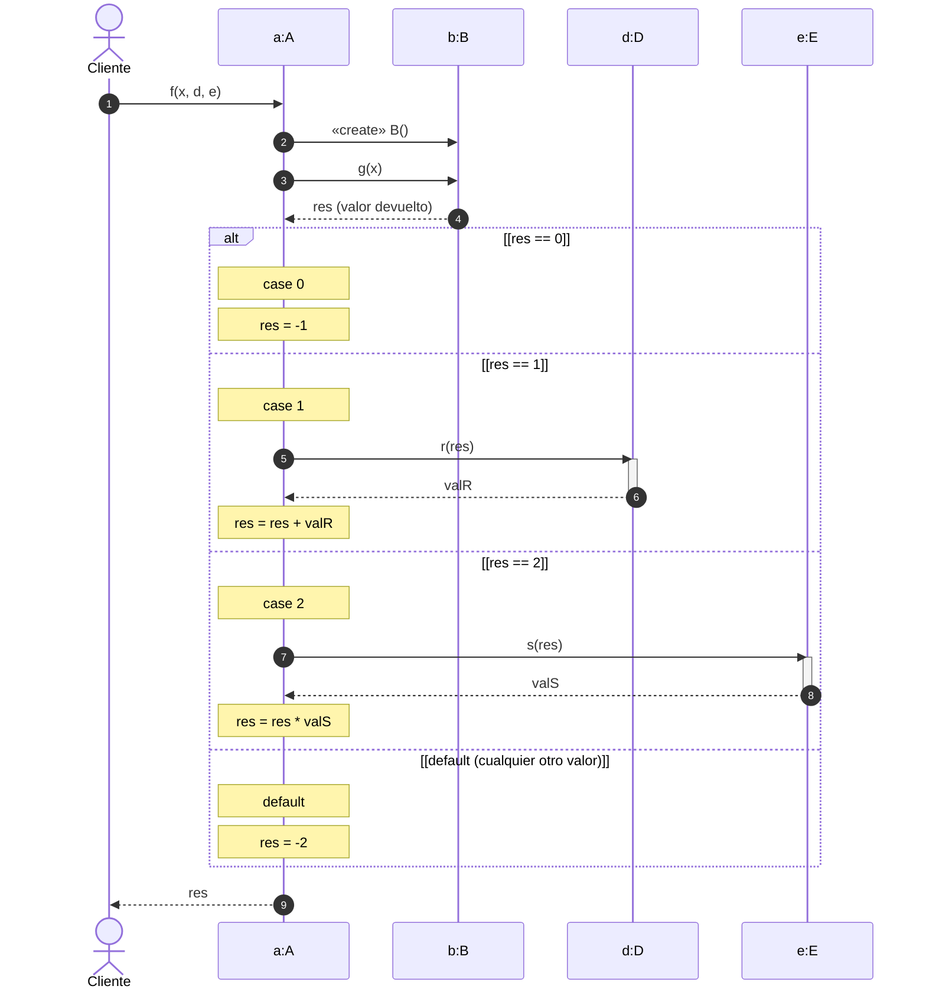
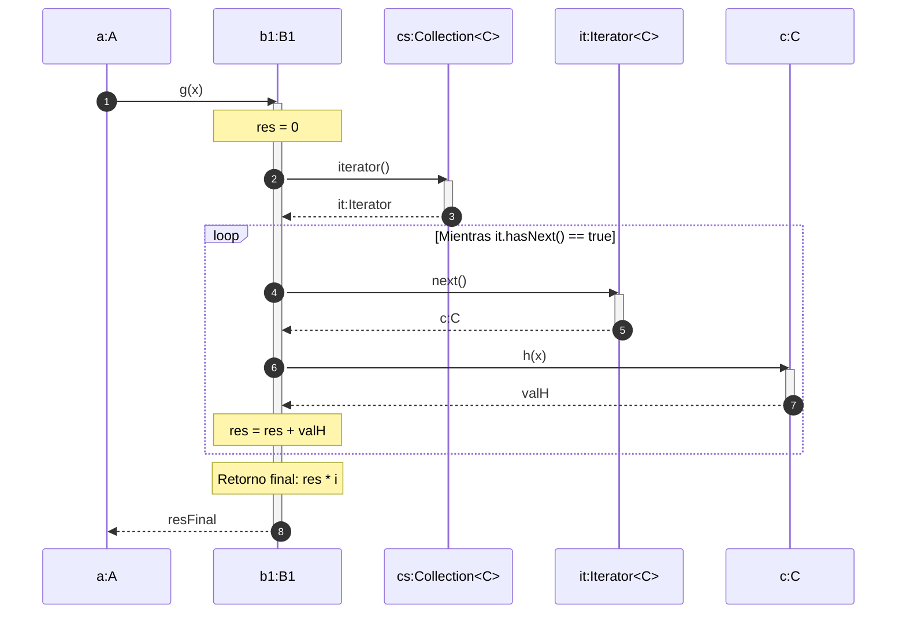
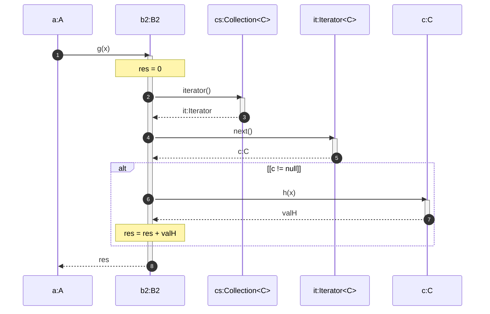

# Solución del Ejercicio de Examen: Modelado UML (Estático y Dinámico)

Este documento contiene la resolución rigurosa de las dos partes del ejercicio de examen (Estructura Estática y Comportamiento Dinámico) a partir del código Java suministrado.

---

## 1. Estructura Estática: Diagrama de Clases UML [2 Puntos]

### Reglas de Modelado Aplicadas (Exigidas por el Enunciado)
* **Restricción de Forma Compacta:** El atributo `Collection<C> cs` en la clase `B` **no** se representa dentro del cajón de atributos de `B` porque su tipo (`Collection<C>`) no es un tipo predefinido de Java (como `int`, `double`, etc.). En su lugar, se modela mediante una **asociación dirigida** desde `B` hacia la interfaz `C`, con multiplicidad `*` (o `0..*`) y el nombre de rol `#cs` (protegido).
* **Tipos Predefinidos:** El atributo `i` en la clase `B1` es de tipo predefinido de Java (`int`), por lo que sí se incluye dentro del cajón de atributos de la clase `B1`.
* **Herencia y Realización:** 
  * `B1` y `B2` heredan de `B` (relación de **generalización** $\rightarrow$ flecha con punta triangular vacía y línea continua).
  * `CI` implementa la interfaz `C` (relación de **realización** $\dashrightarrow$ flecha con punta triangular vacía y línea discontinua).
* **Dependencias de Uso:**
  * La clase `A` crea una instancia local de `B` (relación `«create»` o dependencia `«use»`).
  * La clase `A` recibe como parámetros de su método `f` a las clases abstractas `D` y `E` (relación de dependencia `«use»`).

### Diagrama de Clases UML (Mermaid)

---

## 2. Comportamiento Dinámico: Diagramas de Secuencia UML [3 Puntos]

Para responder con máxima rigurosidad al examen, se presentan los diagramas de secuencia estructurados en tres niveles:
1. **Ejecución Literal de `A.f(x, d, e)`:** Muestra el comportamiento exacto y secuencial según el código tal y como está escrito (donde `b` es estrictamente una instancia de la clase base `B` y `b.g(x)` retorna `0`).
2. **Diagrama Alternativo con Estructura `alt` (Bifurcaciones del `switch`):** Muestra cómo se comportaría dinámicamente el método `A.f` si el valor de `res` tomara los diferentes valores contemplados en el `switch` (0, 1, 2, u otros).
3. **Ejecución Polimórfica en Subclases (`B1.g` y `B2.g`):** Dado que se suministra el código de `B1` y `B2` interactuando con la colección `cs` de elementos `C`, es muy probable que el corrector evalúe si sabes modelar la iteración y el acceso a iteradores en secuencia.

---

### Escenario 1: Ejecución Literal de `A.f(x, d, e)`

Como el código inicializa `B b = new B();`, el objeto instanciado es de tipo `B` (clase base). Su método `g(x)` retorna directamente `0`. Esto hace que el `switch(res)` entre directamente en el `case 0:`, asignando `res = -1` y terminando la ejecución.

---

### Escenario 2: Lógica Completa del `switch` en `A.f(x, d, e)` (Usando `alt`)

Este diagrama modela el comportamiento dinámico completo de la estructura de control `switch-case` en `A.f`, ilustrando las interacciones con los objetos de tipo `D` y `E` pasados por parámetro en los casos correspondientes.

---

### Escenario 3: Comportamiento Interno Polimórfico de `B1.g(x)` y `B2.g(x)`

Si el objeto `b` fuera una subclase de `B` (p. ej., inyectada o polimórfica), la secuencia interna de `g(x)` varía sustancialmente interactuando con la colección `cs` de elementos `C`:

#### Caso 3.1: Ejecución de `B1.g(x)` (Bucle iterador `for-each` sobre `Collection<C>`)

`B1` recorre la colección `cs` llamando al método `h(x)` de cada elemento `c` de tipo `C` (p. ej., una instancia de `CI`).

#### Caso 3.2: Ejecución de `B2.g(x)` (Acceso directo al primer elemento vía Iterator)

`B2` accede únicamente al primer elemento de la colección `cs` usando un iterador, valida que no sea nulo, y ejecuta `h(x)`.

> [!TIP]
> **Puntos clave de cara al examen:**
> * En el **diagrama de clases**, asegúrate de que la flecha de la asociación protegida `cs` vaya de `B` a `C` (es dirigida, puesto que `B` conoce a `C` pero `C` no conoce a `B`). Representar la multiplicidad `*` en el extremo de `C` es vital.
> * En el **diagrama de secuencia**, utilizar correctamente `alt` para el `switch` y `loop` para el bucle iterador de la colección `cs` demuestra un dominio completo y exhaustivo del modelado dinámico UML, garantizando la máxima puntuación en ambos apartados del problema.
