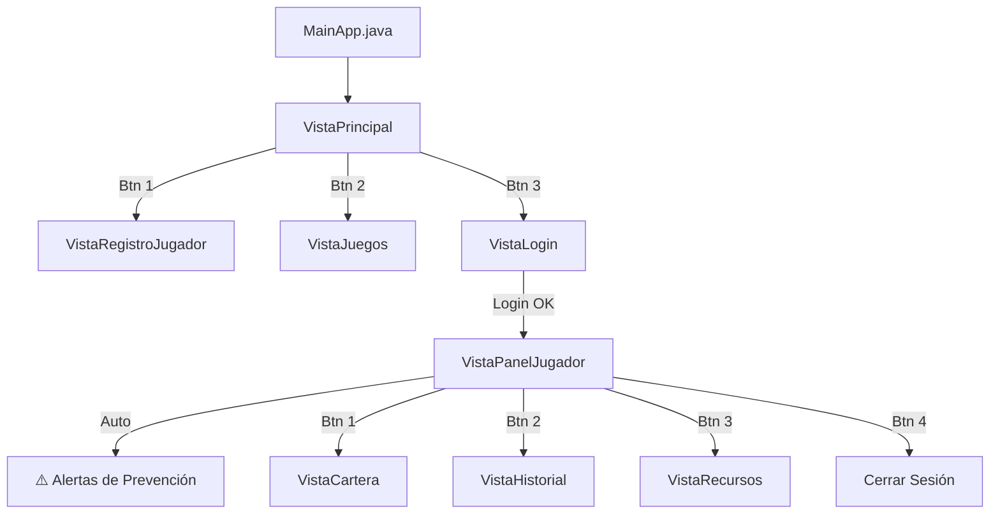

# 📚 Guía del Proyecto: LUDOPATÍA UCM

Aplicación de casino educativo con control de riesgo para ludopatía. Arquitectura **multicapa** en Java Swing + MySQL.

---

## ⚙️ Puesta en Marcha

### 1. MySQL
```sql
CREATE DATABASE apuestasucm;
USE apuestasucm;
-- Ejecutar el script pruebaBD.sql completo
```

### 2. Credenciales
En [BDConexion.java](file:///d:/Uni/ApuestasUCM/src/Integracion/BDConexion.java) (línea 8):
```java
static String password = "equipo8"; // ← Cambiar si tu MySQL tiene otra contraseña
```

### 3. Driver JDBC
Añadir **MySQL Connector/J** al classpath (Eclipse: Build Path → Add External JARs).

### 4. Ejecutar
Run As → Java Application: [MainApp.java](file:///d:/Uni/ApuestasUCM/src/MainApp.java)

---

## 🎮 Funcionalidades Implementadas

| # | Funcionalidad | Tablas BD usadas | Descripción |
|---|---|---|---|
| 1 | **Registrar Jugador** | [Usuario](file:///d:/Uni/ApuestasUCM/src/Negocio/TUsuario.java#3-35), [Jugador](file:///d:/Uni/ApuestasUCM/src/Negocio/Jugador.java#5-37), `Cartera_Virtual` | Crea jugador + cartera con 500 UCM Coins |
| 2 | **Catálogo de Juegos** | [Juego](file:///d:/Uni/ApuestasUCM/src/Negocio/TJuego.java#3-19) | Lee y muestra todos los juegos |
| 3 | **Login** | [Usuario](file:///d:/Uni/ApuestasUCM/src/Negocio/TUsuario.java#3-35) JOIN [Jugador](file:///d:/Uni/ApuestasUCM/src/Negocio/Jugador.java#5-37) | Autentica por correo+password |
| 4 | **Mi Cartera Virtual** | `Cartera_Virtual` | Consultar saldo, ingresar y retirar dinero |
| 5 | **Historial de Apuestas** | [Simulacion](file:///d:/Uni/ApuestasUCM/src/Negocio/Simulacion.java#5-39) | Tabla de partidas + resumen educativo |
| 6 | **Recursos Educativos** | `Recurso_Educativo`, `Jugador_Recurso` | Listar recursos y marcar como vistos (N:M) |
| 7 | **Alertas de Prevención** | `Mensaje_Alerta`, [Simulacion](file:///d:/Uni/ApuestasUCM/src/Negocio/Simulacion.java#5-39) | Pop-up automático al login según pérdidas |

---

## 🔄 Flujo del Usuario



---

## 🧪 Datos de Prueba

| Correo | Contraseña | Riesgo | Saldo | Simulaciones |
|--------|------------|--------|-------|---|
| `roberto@ucm.es` | `pass123` | BAJO | 500 | 1 (con pérdida → salta alerta) |
| `lucia@ucm.es` | `pass456` | ALTO | 1500 | 1 (con ganancia) |

---

## 📁 Archivos por Capa

### Presentación
| Archivo | Función |
|---------|---------|
| [VistaPrincipal.java](file:///d:/Uni/ApuestasUCM/src/Presentacion/VistaPrincipal.java) | Menú principal (3 botones) |
| [VistaLogin.java](file:///d:/Uni/ApuestasUCM/src/Presentacion/VistaLogin.java) | Formulario login |
| [VistaPanelJugador.java](file:///d:/Uni/ApuestasUCM/src/Presentacion/VistaPanelJugador.java) | Hub post-login con alertas |
| [VistaCartera.java](file:///d:/Uni/ApuestasUCM/src/Presentacion/VistaCartera.java) | Saldo, ingresar, retirar |
| [VistaHistorial.java](file:///d:/Uni/ApuestasUCM/src/Presentacion/VistaHistorial.java) | Historial + resumen educativo |
| [VistaRecursos.java](file:///d:/Uni/ApuestasUCM/src/Presentacion/VistaRecursos.java) | Recursos educativos |
| [VistaRegistroJugador.java](file:///d:/Uni/ApuestasUCM/src/Presentacion/VistaRegistroJugador.java) | Formulario registro |
| [VistaJuegos.java](file:///d:/Uni/ApuestasUCM/src/Presentacion/VistaJuegos.java) | Catálogo de juegos |
| Controllers | [ControladorJugador](file:///d:/Uni/ApuestasUCM/src/Presentacion/ControladorJugador.java#7-49), [ControladorJuego](file:///d:/Uni/ApuestasUCM/src/Presentacion/ControladorJuego.java#9-29), [ControladorSimulacion](file:///d:/Uni/ApuestasUCM/src/Presentacion/ControladorSimulacion.java#8-29), [ControladorCartera](file:///d:/Uni/ApuestasUCM/src/Presentacion/ControladorCartera.java#7-41), [ControladorRecursoEducativo](file:///d:/Uni/ApuestasUCM/src/Presentacion/ControladorRecursoEducativo.java#8-33) |

### Negocio
| Archivo | Función |
|---------|---------|
| Transfer Objects | [TUsuario](file:///d:/Uni/ApuestasUCM/src/Negocio/TUsuario.java#3-35), [TJugador](file:///d:/Uni/ApuestasUCM/src/Negocio/TJugador.java#3-15), [TJuego](file:///d:/Uni/ApuestasUCM/src/Negocio/TJuego.java#3-19), [TSimulacion](file:///d:/Uni/ApuestasUCM/src/Negocio/TSimulacion.java#7-48), [TCartera](file:///d:/Uni/ApuestasUCM/src/Negocio/TCartera.java#6-26), [TRecursoEducativo](file:///d:/Uni/ApuestasUCM/src/Negocio/TRecursoEducativo.java#6-26), [TMensajeAlerta](file:///d:/Uni/ApuestasUCM/src/Negocio/TMensajeAlerta.java#6-22) |
| SA Jugador | [SAJugador](file:///d:/Uni/ApuestasUCM/src/Negocio/SAJugador.java#3-9) → [SAJugadorImpl](file:///d:/Uni/ApuestasUCM/src/Negocio/SAJugadorImpl.java#6-41) (registro + login) |
| SA Juego | [SAJuego](file:///d:/Uni/ApuestasUCM/src/Negocio/SAJuego.java#5-8) → [SAJuegoImpl](file:///d:/Uni/ApuestasUCM/src/Negocio/SAJuegoImpl.java#7-18) (listar juegos) |
| SA Simulacion | [SASimulacion](file:///d:/Uni/ApuestasUCM/src/Negocio/SASimulacion.java#5-9) → [SASimulacionImpl](file:///d:/Uni/ApuestasUCM/src/Negocio/SASimulacionImpl.java#7-21) (historial) |
| SA Cartera | [SACartera](file:///d:/Uni/ApuestasUCM/src/Negocio/SACartera.java#3-13) → [SACarteraImpl](file:///d:/Uni/ApuestasUCM/src/Negocio/SACarteraImpl.java#6-52) (consultar/ingresar/retirar) |
| SA Recurso | [SARecursoEducativo](file:///d:/Uni/ApuestasUCM/src/Negocio/SARecursoEducativo.java#5-12) → [SARecursoEducativoImpl](file:///d:/Uni/ApuestasUCM/src/Negocio/SARecursoEducativoImpl.java#7-24) (listar/marcar visto) |
| SA Alerta | [SAMensajeAlerta](file:///d:/Uni/ApuestasUCM/src/Negocio/SAMensajeAlerta.java#5-9) → [SAMensajeAlertaImpl](file:///d:/Uni/ApuestasUCM/src/Negocio/SAMensajeAlertaImpl.java#7-19) (alertas por umbral) |

### Integración
| Archivo | Función |
|---------|---------|
| [BDConexion.java](file:///d:/Uni/ApuestasUCM/src/Integracion/BDConexion.java) | Conexión MySQL singleton |
| DAO Jugador | [DAOJugador](file:///d:/Uni/ApuestasUCM/src/Integracion/DAOJugador.java#5-12) → [DAOJugadorImp](file:///d:/Uni/ApuestasUCM/src/Integracion/DAOJugadorImp.java#9-107) (INSERT + SELECT JOIN) |
| DAO Juego | [DAOJuego](file:///d:/Uni/ApuestasUCM/src/Integracion/DAOJuegoImpl.java#10-34) → [DAOJuegoImpl](file:///d:/Uni/ApuestasUCM/src/Integracion/DAOJuegoImpl.java#10-34) (SELECT *) |
| DAO Simulacion | [DAOSimulacion](file:///d:/Uni/ApuestasUCM/src/Integracion/DAOSimulacion.java#6-11) → [DAOSimulacionImp](file:///d:/Uni/ApuestasUCM/src/Integracion/DAOSimulacionImp.java#11-47) (SELECT WHERE jugador) |
| DAO Cartera | [DAOCartera](file:///d:/Uni/ApuestasUCM/src/Integracion/DAOCartera.java#5-12) → [DAOCarteraImp](file:///d:/Uni/ApuestasUCM/src/Integracion/DAOCarteraImp.java#9-55) (SELECT + UPDATE saldo) |
| DAO Recurso | [DAORecursoEducativo](file:///d:/Uni/ApuestasUCM/src/Integracion/DAORecursoEducativo.java#6-16) → [DAORecursoEducativoImpl](file:///d:/Uni/ApuestasUCM/src/Integracion/DAORecursoEducativoImpl.java#13-83) (SELECT + INSERT N:M) |
| DAO Alerta | [DAOMensajeAlerta](file:///d:/Uni/ApuestasUCM/src/Integracion/DAOMensajeAlerta.java#6-10) → [DAOMensajeAlertaImp](file:///d:/Uni/ApuestasUCM/src/Integracion/DAOMensajeAlertaImp.java#11-40) (SELECT WHERE umbral) |
