# 📚 Guía Completa del Proyecto: LUDOPATÍA UCM (ApuestasUCM)

> Aplicación educativa de casino con sistema de prevención de ludopatía.  
> Stack: **Java Swing + MySQL**, patrón **MVC por capas** (3-tier architecture).

---

## 📋 Índice

1. [Arquitectura General](#arquitectura-general)
2. [Base de Datos — Esquema Completo](#base-de-datos)
3. [Capa de Integración — DAOs](#capa-integracion)
4. [Capa de Negocio — SAs y Transfer Objects](#capa-negocio)
5. [Capa de Presentación — Vistas y Controladores](#capa-presentacion)
6. [Flujos Completos por Funcionalidad](#flujos)
7. [Datos de Prueba](#datos-prueba)
8. [Puesta en Marcha](#puesta-en-marcha)
9. [Patrones de Diseño Implementados](#patrones)

---

## 🏗️ Arquitectura General {#arquitectura-general}

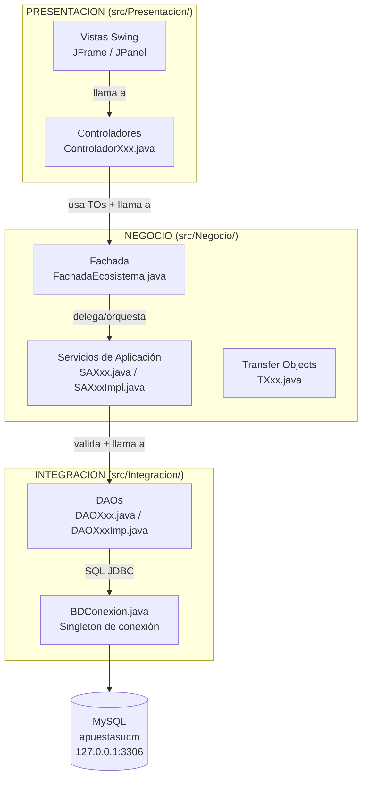

| Capa | Paquete | Responsabilidad |
|------|---------|-----------------|
| **Presentación** | `Presentacion/` | Interfaz gráfica Swing. Los **Controladores** reciben eventos de las Vistas y los traducen en llamadas al SA. |
| **Negocio** | `Negocio/` | Lógica de negocio y validaciones (edad, saldo, etc.). Los **SA** coordinan y los **Transfer Objects** transportan datos entre capas. |
| **Integración** | `Integracion/` | Acceso a MySQL vía JDBC. Cada **DAO** cubre una entidad de la BD y ejecuta el SQL correspondiente. |

---

## 🗄️ Base de Datos — Esquema Completo {#base-de-datos}

### Diagrama Entidad-Relación

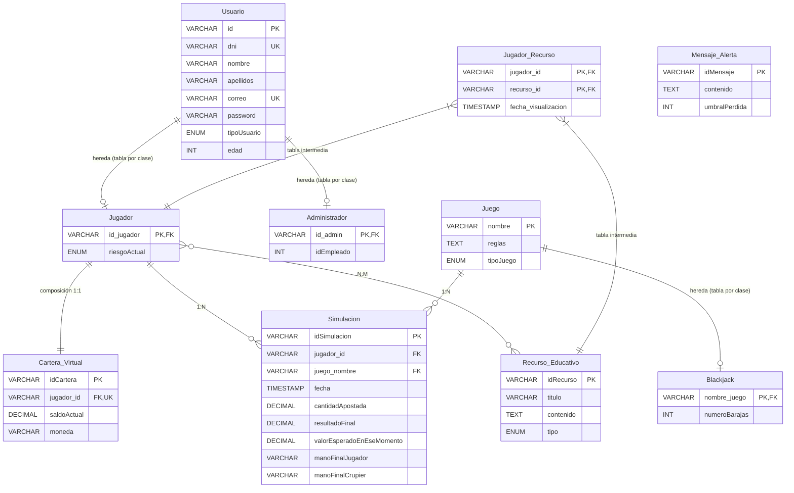

### Tablas y campos clave

| Tabla | PK | Notas |
|-------|----|-------|
| `Usuario` | `id` (VARCHAR 50) | Padre de Jugador y Administrador. `tipoUsuario`: JUGADOR / ADMINISTRADOR |
| `Jugador` | `id_jugador` (FK → Usuario.id) | `riesgoActual`: BAJO / MEDIO / ALTO |
| `Administrador` | `id_admin` (FK → Usuario.id) | `idEmpleado` |
| `Juego` | `nombre` | `tipoJuego`: BLACKJACK / OTRO |
| `Blackjack` | `nombre_juego` (FK → Juego.nombre) | `numeroBarajas` |
| `Cartera_Virtual` | `idCartera` | `jugador_id` UNIQUE → 1:1 con Jugador. `saldoActual`, `moneda` |
| `Simulacion` | `idSimulacion` | FK al jugador y al juego. Guarda apuesta, resultado, manos |
| `Recurso_Educativo` | `idRecurso` | `tipo`: VIDEO / ARTICULO / TEST |
| `Jugador_Recurso` | (`jugador_id`, `recurso_id`) | Tabla N:M de recursos vistos. Tiene `fecha_visualizacion` |
| `Mensaje_Alerta` | `idMensaje` | `umbralPerdida` (entero). Se devuelven si pérdidas > umbral |

---

## 🔌 Capa de Integración — DAOs {#capa-integracion}

### `BDConexion.java` — Singleton de conexión

```
BDConexion
├── getConnection() : Connection   → devuelve/reutiliza la conexión singleton
└── desconectar()                  → cierra la conexión
```

- URL: `jdbc:mysql://127.0.0.1:3306/apuestasucm?useSSL=false&serverTimezone=UTC&allowPublicKeyRetrieval=true`
- Usuario: `root` / Contraseña: `equipo8`
- Timeout de login: 5 segundos.

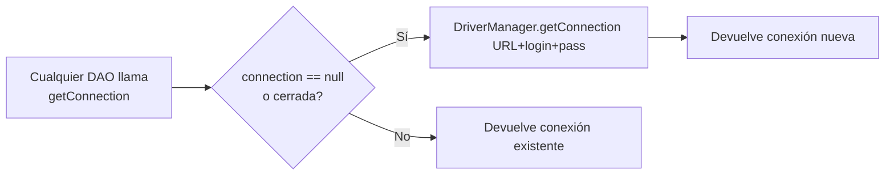

---

### `DAOJugadorImp.java`

| Método | SQL | Descripción |
|--------|-----|-------------|
| `registrarJugador(TJugador)` | INSERT en `Usuario` + `Jugador` + `Cartera_Virtual` | Transacción con commit/rollback. Cartera inicial: 500 UCM Coins |
| `buscarPorCorreoYPassword(correo, pass)` | `SELECT … FROM Usuario INNER JOIN Jugador WHERE correo=? AND password=?` | Devuelve `TJugador` o null |
| `actualizarRiesgo(idJugador, nuevoRiesgo)` | `UPDATE Jugador SET riesgoActual=? WHERE id_jugador=?` | Actualizado automáticamente tras cada partida |
| `leerTodos()` | `SELECT ... FROM Usuario INNER JOIN Jugador` | Devuelve lista de todos los `TJugador` (Operación Read) |
| `editarJugador(TJugador)` | `UPDATE Usuario ...`, `UPDATE Jugador ...` | Modifica datos del usuario (Operación Update) |
| `eliminarJugador(id)` | `DELETE FROM Usuario WHERE id=?` | Borrado en cascada de cuenta (Operación Delete) |

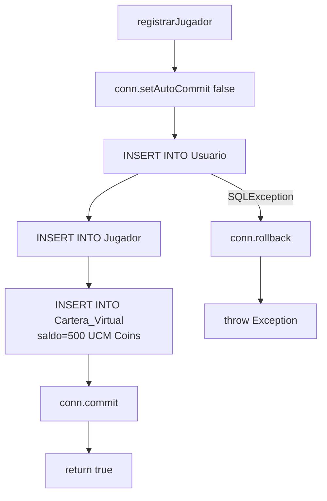

---

### `DAOCarteraImp.java`

| Método | SQL | Descripción |
|--------|-----|-------------|
| `leerPorJugador(jugadorId)` | `SELECT * FROM Cartera_Virtual WHERE jugador_id=?` | Devuelve `TCartera` |
| `actualizarSaldo(jugadorId, nuevoSaldo)` | `UPDATE Cartera_Virtual SET saldoActual=? WHERE jugador_id=?` | Devuelve `true` si ≥1 fila actualizada |

---

### `DAOSimulacionImp.java`

| Método | SQL | Descripción |
|--------|-----|-------------|
| `leerPorJugador(jugadorId)` | `SELECT * FROM Simulacion WHERE jugador_id=?` | Devuelve `List<TSimulacion>` |
| `insertar(TSimulacion)` | `INSERT INTO Simulacion (…)` | Guarda una partida recién jugada |

---

### `DAOJuegoImpl.java`

| Método | SQL | Descripción |
|--------|-----|-------------|
| `leerTodos()` | `SELECT * FROM Juego` | Devuelve `List<TJuego>` |

---

### `DAOMensajeAlertaImp.java`

| Método | SQL | Descripción |
|--------|-----|-------------|
| `leerPorUmbral(perdidasAcumuladas)` | `SELECT * FROM Mensaje_Alerta WHERE umbralPerdida <= ?` | Devuelve alertas cuyo umbral esté superado |

---

### `DAORecursoEducativoImpl.java`

| Método | SQL | Descripción |
|--------|-----|-------------|
| `leerTodos()` | `SELECT * FROM Recurso_Educativo` | Lista completa de recursos |
| `buscarRecurso(idRecurso)` | `SELECT * FROM Recurso_Educativo WHERE idRecurso=?` | Un recurso por ID |
| `registrarVisualizacion(jugadorId, recursoId)` | `INSERT INTO Jugador_Recurso (jugador_id, recurso_id)` | Marca como visto (N:M) |
| `leerVistosPorJugador(jugadorId)` | `SELECT RE.* FROM Recurso_Educativo RE JOIN Jugador_Recurso JR ON … WHERE JR.jugador_id=?` | Recursos ya vistos por un jugador |

---

### `DAOAdministradorImp.java`

| Método | SQL | Descripción |
|--------|-----|-------------|
| `buscarPorCorreoYPassword(correo, pass)` | `SELECT … FROM Usuario INNER JOIN Administrador ...` | Devuelve un `TAdministrador` si se autentica correctamente. |

---

## ⚙️ Capa de Negocio — SAs y Transfer Objects {#capa-negocio}

### Transfer Objects (TOs)

Los TOs son simples POJOs (solo campos + getters/setters) que transportan datos entre capas sin lógica.

| Clase | Campos principales |
|-------|--------------------|
| `TUsuario` | `id`, `dni`, `nombre`, `apellidos`, `correo`, `password`, `tipoUsuario`, `edad` |
| `TJugador` | hereda de TUsuario + `riesgoActual` (String: BAJO/MEDIO/ALTO) |
| `TJuego` | `nombre`, `reglas`, `tipoJuego` |
| `TSimulacion` | `idSimulacion`, `jugadorId`, `juegoNombre`, `cantidadApostada`, `resultadoFinal`, `valorEsperadoEnEseMomento`, `manoFinalJugador`, `manoFinalCrupier`, `fecha` |
| `TCartera` | `idCartera`, `jugadorId`, `saldoActual`, `moneda` |
| `TRecursoEducativo` | `idRecurso`, `titulo`, `contenido`, `tipo` |
| `TMensajeAlerta` | `idMensaje`, `contenido`, `umbralPerdida` |

---

### `SAJugadorImpl.java`

```
SAJugador (interface)
└── SAJugadorImpl (implements)
    ├── registrarJugador(TJugador) : boolean
    │     → Valida: edad >= 18, DNI no vacío, contraseña >= 5 chars
    │     → Delega a DAOJugadorImp.registrarJugador()
    └── login(correo, password) : TJugador
          → Valida: correo y password no vacíos
          → Delega a DAOJugadorImp.buscarPorCorreoYPassword()
          → Si null → throw Exception "Correo o contraseña incorrectos"
```

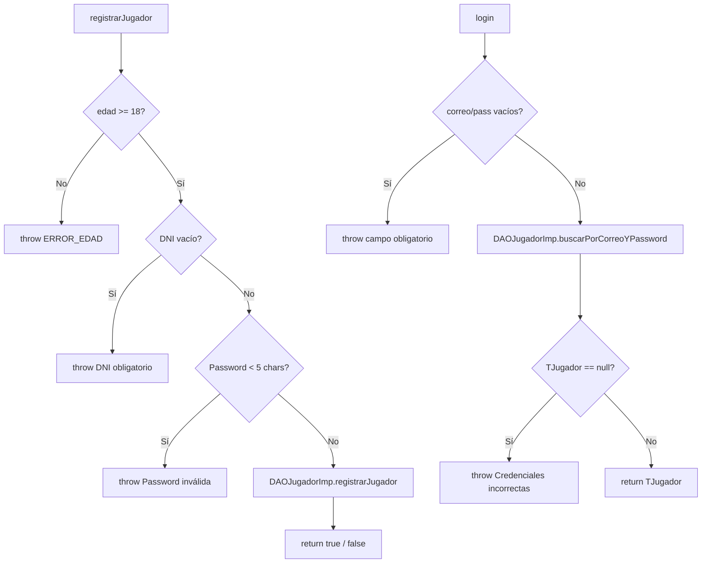

---

### `SACarteraImpl.java`

```
SACartera (interface)
└── SACarteraImpl (implements)
    ├── consultarCartera(jugadorId) : TCartera
    ├── ingresarDinero(jugadorId, cantidad) : boolean
    │     → Valida: cantidad > 0
    │     → Lee cartera → nuevoSaldo = actual + cantidad → actualizarSaldo
    └── retirarDinero(jugadorId, cantidad) : boolean
          → Valida: cantidad > 0
          → Lee cartera → Valida saldo suficiente → nuevoSaldo = actual - cantidad → actualizarSaldo
```

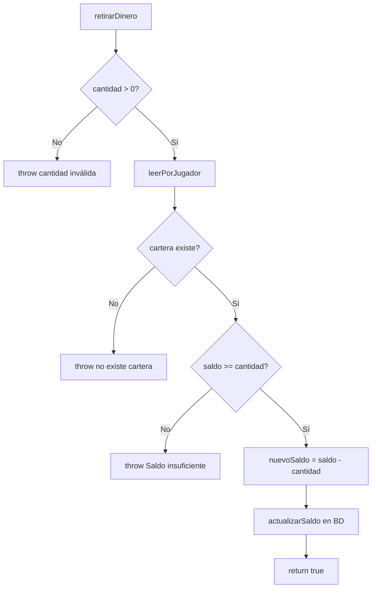

---

### `SASimulacionImpl.java`

```
SASimulacion (interface)
└── SASimulacionImpl (implements)
    ├── consultarHistorial(jugadorId) : List<TSimulacion>
    │     → Valida: jugadorId no vacío
    │     → Delega a DAOSimulacionImp.leerPorJugador()
    └── jugarBlackjack(jugadorId, cantidadApostada) : TSimulacion
          → Valida: jugadorId, cantidadApostada > 0
          → Retira apuesta de cartera (SACarteraImpl.retirarDinero)
          → Simula resultado: 48% prob victoria (Math.random < 0.48)
          → Si gana → ingresa 2x apuesta en cartera
          → Crea TSimulacion y la inserta en BD
          → Llama a actualizarRiesgoLudopatia()
          → Retorna TSimulacion resultante
    
    [privado] actualizarRiesgoLudopatia(jugadorId, daoJugador, daoSim)
          → Obtiene historial completo del jugador
          → Calcula: perdidasTotales, perdidasConsecutivas (desde lo más reciente)
          → BAJO si < 2 cons. y < 100 total
          → MEDIO si >= 2 cons. O > 100 total
          → ALTO si >= 4 cons. O > 200 total
          → daoJugador.actualizarRiesgo(jugadorId, nuevoRiesgo)
```

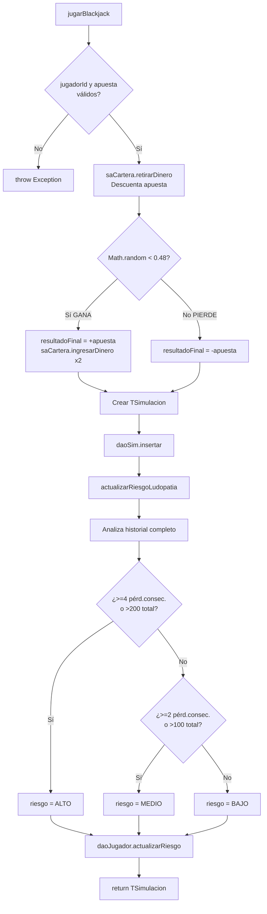

---

### `SARecursoEducativoImpl.java`

```
SARecursoEducativo (interface)
└── SARecursoEducativoImpl (implements)
    ├── listarRecursos() : List<TRecursoEducativo>
    ├── buscarRecurso(idRecurso) : TRecursoEducativo
    ├── marcarComoVisto(jugadorId, recursoId) : boolean
    │     → Valida ambos IDs no nulos
    │     → dao.registrarVisualizacion()
    └── listarRecursosVistos(jugadorId) : List<TRecursoEducativo>
          → Valida jugadorId no nulo
          → dao.leerVistosPorJugador()
```

---

### `SAMensajeAlertaImpl.java`

```
SAMensajeAlerta (interface)
└── SAMensajeAlertaImpl (implements)
    └── obtenerAlertas(perdidasAcumuladas) : List<TMensajeAlerta>
          → Si perdidasAcumuladas <= 0 → devuelve lista vacía
          → dao.leerPorUmbral(perdidasAcumuladas)
```

---

## 🖥️ Capa de Presentación — Vistas y Controladores {#capa-presentacion}

### Controladores

| Clase | Métodos | SA Usado |
|-------|---------|----------|
| `ControladorJugador` | `procesarRegistro(id,dni,nombre,apellidos,correo,pass,edad)`, `procesarLogin(correo,pass)` | `SAJugadorImpl` |
| `ControladorCartera` | `consultarCartera(jugadorId)`, `ingresarDinero(jugadorId,cantidad)`, `retirarDinero(jugadorId,cantidad)` | `SACarteraImpl` |
| `ControladorSimulacion` | `solicitarHistorial(jugadorId)`, `jugarBlackjack(jugadorId,apuesta)` | `SASimulacionImpl` |
| `ControladorJuego` | `solicitarJuegos()` | `SAJuegoImpl` |
| `ControladorRecursoEducativo` | `solicitarRecursos()`, `marcarComoVisto(jugadorId,recursoId)`, `solicitarHistorial(jugadorId)` | `SARecursoEducativoImpl` |

> **Patrón de todos los controladores:** capturan la excepción del SA, la loguean por `System.err` y devuelven `null` / `false` a la vista si hay error.

---

### Vistas (JFrame / JPanel)

| Vista | Qué muestra | Controlador(es) que usa |
|-------|-------------|------------------------|
| `VistaPrincipal` | Menú inicial: 3 botones (Registrar, Catálogo, Login) | — |
| `VistaRegistroJugador` | Formulario de alta (nombre, DNI, correo, contraseña, edad) | `ControladorJugador` |
| `VistaLogin` | Formulario login con opciones de rol (Jugador / Administrador) | `ControladorJugador`, `ControladorAdministrador` |
| `VistaPanelJugador` | Hub post-login. Muestra alertas, botones de funcionalidad y "Mi Perfil" | `ControladorSimulacion`, `SAMensajeAlertaImpl` |
| `VistaPerfilJugador` | Permite actualizar datos personales o eliminar cuenta propia | `ControladorJugador` |
| `VistaPanelAdministrador` | Menú post-login exclusivo para administradores | `ControladorAdministrador` |
| `VistaGestionJugadores` | Listado completo CRUD de jugadores (Editar/Borrar plataforma) | `ControladorJugador` |
| `VistaCartera` | Saldo actual + botones Ingresar / Retirar | `ControladorCartera` |
| `VistaHistorial` | Tabla de simulaciones + resumen educativo (total apostado, balance, % victorias) | `ControladorSimulacion` |
| `VistaJuegos` | Tabla de todos los juegos disponibles + botón Jugar Blackjack | `ControladorJuego`, `ControladorSimulacion` |
| `VistaPlayBlackjack` | Formulario para introducir apuesta y ver resultado de la mano | `ControladorSimulacion` |
| `VistaRecursos` | Lista de recursos educativos + botón "Marcar como visto" + historial visto | `ControladorRecursoEducativo` |

---

## 🔄 Flujos Completos por Funcionalidad {#flujos}

### 1. Registro de Jugador

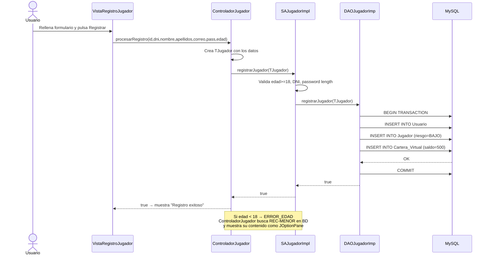

---

### 2. Login + Alertas Automáticas

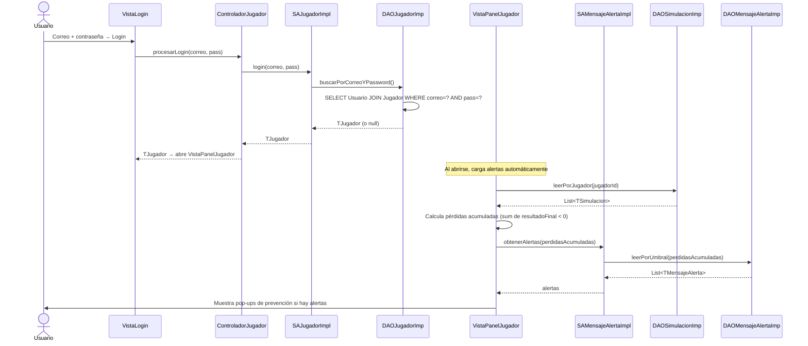

---

### 3. Jugar al Blackjack

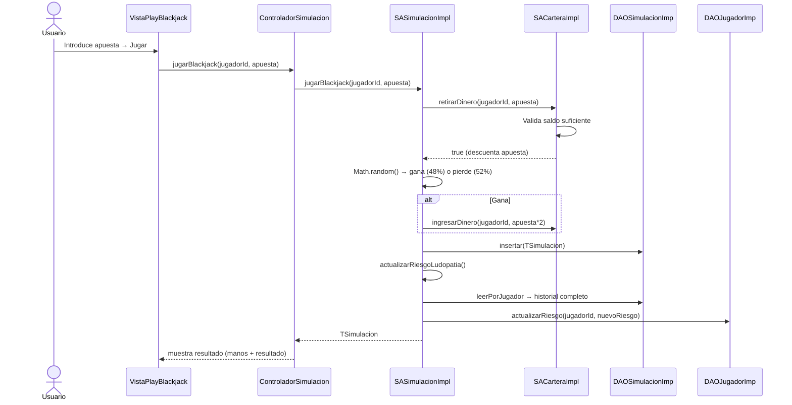

---

### 4. Cartera Virtual

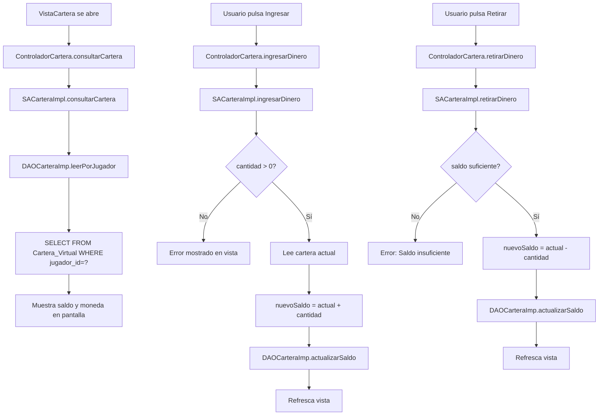

---

### 5. Recursos Educativos

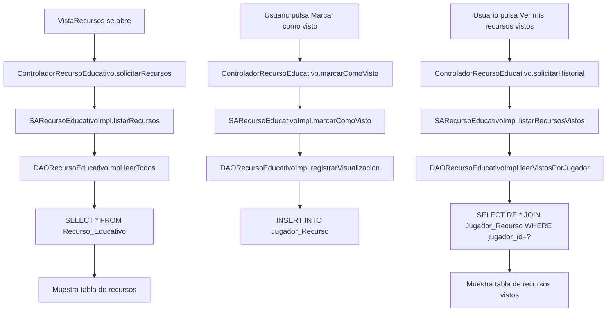

---

### 6. Evaluación de Riesgo de Ludopatía (detalle)

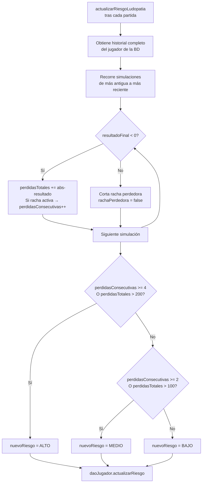

---

### 7. Flujo Global de Navegación

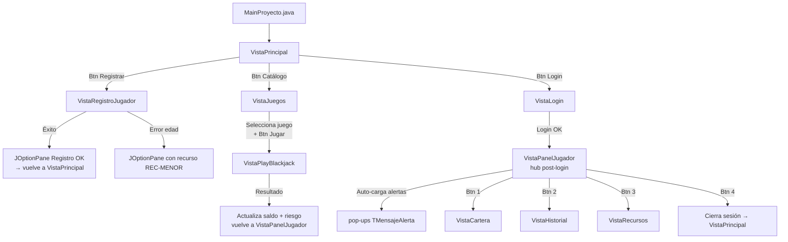

---

## 🧪 Datos de Prueba {#datos-prueba}

| Tipo | ID | Correo | Contraseña | Riesgo | Saldo | Simulaciones |
|------|----|--------|------------|--------|-------|--------------|
| Jugador | `U-002` | `roberto@ucm.es` | `pass123` | BAJO | 500 UCM Coins | 1 (perdió 50) |
| Jugador | `U-003` | `lucia@ucm.es` | `pass456` | ALTO | 1500 UCM Coins | 1 (ganó 100) |
| Admin | `U-001` | `admin@ucm.es` | `admin123` | — | — | No puede hacer login |

**Alertas pre-cargadas:**
| ID | Umbral pérdida | Mensaje |
|----|----------------|---------|
| `MSG-01` | 50 | "Recuerda: el Blackjack es un juego de azar, no de inversión." |
| `MSG-02` | 200 | "Si la diversión se detiene, detente tú también." |

**Recurso educativo pre-cargado:**
| ID | Tipo | Título |
|----|------|--------|
| `REC-01` | VIDEO | "El peligro de perseguir pérdidas" |
| `REC-MENOR` | *(buscado por código)* | Recurso para menores de edad mostrado al intentar registrarse |

---

## ⚙️ Puesta en Marcha {#puesta-en-marcha}

### Paso 1 — MySQL

```sql
CREATE DATABASE apuestasucm;
USE apuestasucm;
-- Ejecutar el archivo completo: pruebaBD.sql
```

### Paso 2 — Credenciales

En [`BDConexion.java`](file:///c:/Users/pable/OneDrive/Desktop/25-26/Segundo%20cuatri/IS2/proyecto-de-is2-equipo-08-apuestasucm/src/Integracion/BDConexion.java) (línea 8):

```java
static String password = "equipo8";  // ← Cambiar si tu MySQL tiene otra contraseña
```

### Paso 3 — Driver JDBC

Añadir **MySQL Connector/J** al classpath:
- Eclipse: clic derecho en el proyecto → **Build Path → Add External JARs** → selecciona el `.jar`
- Descarga en: [mysql.com/downloads/connector/j](https://dev.mysql.com/downloads/connector/j/)

### Paso 4 — Ejecutar

Ejecutar [`MainProyecto.java`](file:///c:/Users/pable/OneDrive/Desktop/25-26/Segundo%20cuatri/IS2/proyecto-de-is2-equipo-08-apuestasucm/src/MainProyecto.java) como **Java Application** (clic derecho → Run As → Java Application).

---

## 📁 Árbol de Archivos Completo

```
src/
├── MainProyecto.java                          ← PUNTO DE ENTRADA ÚNICO
│
├── Presentacion/
│   ├── VistaPrincipal.java               ← Menú inicio (3 botones)
│   ├── VistaRegistroJugador.java         ← Formulario de registro
│   ├── VistaLogin.java                   ← Formulario login con roles
│   ├── VistaPanelJugador.java            ← Hub post-login + de Jugador
│   ├── VistaPerfilJugador.java           ← Edición / Borrado de Cuenta Propia
│   ├── VistaPanelAdministrador.java      ← Hub post-login de Administrador
│   ├── VistaGestionJugadores.java        ← Panel CRUD general de Jugadores
│   ├── VistaCartera.java                 ← Consultar/Ingresar/Retirar saldo
│   ├── VistaHistorial.java               ← Tabla historial + resumen
│   ├── VistaJuegos.java                  ← Catálogo de juegos
│   ├── VistaPlayBlackjack.java           ← Interfaz de juego Blackjack (ahora dispara recurso automático)
│   ├── VistaDialogoRecurso.java          ← Popup flotante custom (HTML) para forzar lectura de prevención
│   ├── VistaRecursos.java                ← Recursos educativos + historial
│   ├── ControladorJugador.java           ← CRUD y Auth Jugador
│   ├── ControladorAdministrador.java     ← Auth de Administrador
│   ├── ControladorCartera.java           
│   ├── ControladorSimulacion.java        
│   ├── ControladorJuego.java             
│   └── ControladorRecursoEducativo.java  
│
├── Negocio/
│   ├── FachadaEcosistema.java             ← Patrón Facade: Interfaz unificada para UI
│   ├── FachadaEcosistemaImpl.java         ← Implementación del Facade que coordina SAs
│   ├── TUsuario.java                     ← TO base de usuarios (Usa Builder)
│   ├── TJugador.java                     ← TO jugador (hereda, Usa Builder)
│   ├── TAdministrador.java               ← TO administrador (hereda)
│   ├── TJuego.java                       
│   ├── TSimulacion.java                  
│   ├── TCartera.java                     ← TO Cartera (Usa Builder)
│   ├── TRecursoEducativo.java            ← TO Recurso (Usa Builder)
│   ├── TMensajeAlerta.java               
│   ├── SAJugador.java                    ← Interface: Auth + CRUD completo
│   ├── SAJugadorImpl.java                
│   ├── SAAdministrador.java              ← Interface: Auth Admin
│   ├── SAAdministradorImpl.java          
│   ├── SACartera.java                    
│   ├── SACarteraImpl.java                
│   ├── SASimulacion.java                 
│   ├── SASimulacionImpl.java             
│   ├── SAJuego.java                      
│   ├── SAJuegoImpl.java                  
│   ├── SARecursoEducativo.java           
│   ├── SARecursoEducativoImpl.java       
│   ├── SAMensajeAlerta.java              
│   ├── SAMensajeAlertaImpl.java          
│
└── Integracion/
    ├── BDConexion.java                   ← Singleton MySQL
    ├── DAOJugador.java                   
    ├── DAOJugadorImp.java                ← CRUD SQL de Jugadores
    ├── DAOAdministrador.java             
    ├── DAOAdministradorImp.java          ← SELECT SQL Administrador
    ├── DAOCartera.java                   
    ├── DAOCarteraImp.java                
    ├── DAOSimulacion.java                
    ├── DAOSimulacionImp.java             
    ├── DAOJuego.java                     
    ├── DAOJuegoImpl.java                 
    ├── DAORecursoEducativo.java          
    ├── DAORecursoEducativoImpl.java      
    ├── DAOMensajeAlerta.java             
    └── DAOMensajeAlertaImp.java          

pruebaBD.sql                              ← Script DDL + DML completo (1.6)
```

---

## 🏗️ 9. Patrones de Diseño Implementados {#patrones}

Como parte de la evolución de la arquitectura y siguiendo la guía GoF, el proyecto implementa los siguientes patrones para asegurar el bajo acoplamiento y alta cohesión.

### 9.1 Patrón Builder (Creacional)
**Archivos:** `TUsuario.java`, `TJugador.java`, `TCartera.java`, `TRecursoEducativo.java`.

Los Transfer Objects se construyen ahora previniendo el uso excesivo de métodos `.set...()` secuenciales (API Fluida). Esto hace más evidente la creación de objetos en un solo "pass", algo crucial en el `ControladorJugador` a la hora de registrar a un usuario con múltiples detalles.

**Ejemplo de uso:**
```java
TJugador nuevoJugador = new TJugador.Builder()
        .conId(id)
        .conDni(dni)
        .conNombre(nombre)
        .conApellidos(apellidos)
        .conCorreo(correo)
        .conPassword(pass)
        .conEdad(edad)
        .build();
```

### 9.2 Patrón Facade (Estructural)
**Archivos:** `FachadaEcosistema.java`, `FachadaEcosistemaImpl.java`.

La Fachada proporciona una interfaz única y simplificada enfocada 100% para la Capa de Presentación, resguardándola de la lógica sobre múltiples `SA (Servicios de Aplicación)`. 

*   **Problema resuelto:** Los Controladores estaban asumiendo responsabilidades orquestales. Por ejemplo, al dar un error de edad, el `ControladorJugador` instanciaba directamente un `SARecursoEducativo` para dar el popup apropiado. Con la fachada, el controlador solo interactúa con un único objeto genérico `facade`.
*   **Implementación:** Componentes visuales instancian `FachadaEcosistema facade = new FachadaEcosistemaImpl();`. Cuando piden `facade.ingresarDinero()`, internamente la fachada averigua qué SA se encarga de esto e invoca su lógica, quitando acoplamiento directo entre Presentación y cada subsistema individual de Negocio.

