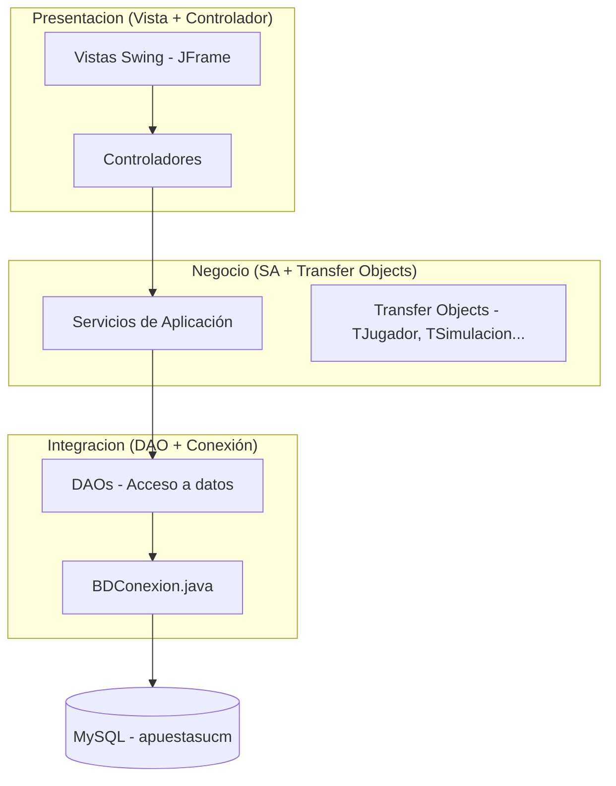
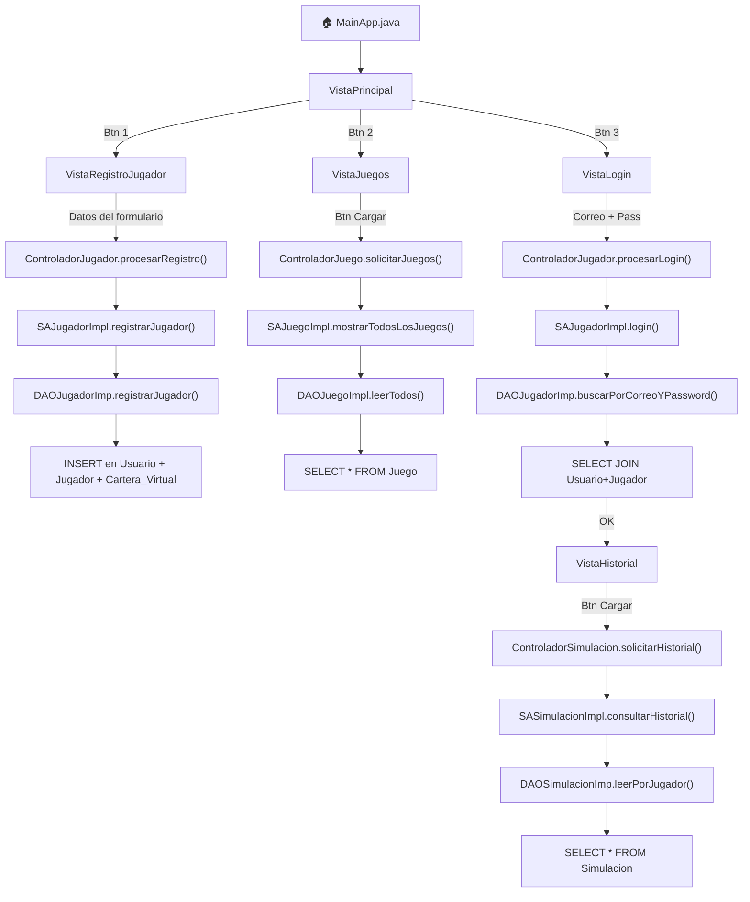

# 📚 Guía del Proyecto: LUDOPATÍA UCM

Aplicación de casino educativo con control de riesgo para ludopatía, construida con arquitectura **multicapa** en Java Swing + MySQL.

---

## 🏗️ Arquitectura Multicapa



| Capa | Paquete | Responsabilidad |
|------|---------|-----------------|
| **Presentación** | `Presentacion/` | Interfaz gráfica (Swing) + Controladores |
| **Negocio** | `Negocio/` | Validaciones, reglas de negocio, Transfer Objects |
| **Integración** | `Integracion/` | Consultas SQL, conexión a MySQL |

---

## ⚙️ Configuración y Puesta en Marcha

### Paso 1: MySQL

1. Tener **MySQL Server** corriendo en `127.0.0.1:3306`
2. Crear la base de datos:
```sql
CREATE DATABASE apuestasucm;
USE apuestasucm;
```
3. Ejecutar el script [pruebaBD.sql](file:///d:/Uni/ApuestasUCM/pruebaBD.sql) completo — crea todas las tablas e inserta datos de prueba

### Paso 2: Credenciales de conexión

La conexión se configura en [BDConexion.java](file:///d:/Uni/ApuestasUCM/src/Integracion/BDConexion.java):

```java
static String bd = "apuestasucm";
static String login = "root";
static String password = "equipo8";  // ← Cambiar si tu contraseña de MySQL es otra
```

> [!IMPORTANT]
> Si tu contraseña de MySQL **no** es `equipo8`, cámbiala en la línea 8 de [BDConexion.java](file:///d:/Uni/ApuestasUCM/src/Integracion/BDConexion.java).

### Paso 3: Driver JDBC

Asegúrate de tener el **MySQL Connector/J** (`.jar`) en el classpath del proyecto Eclipse:
1. Descárgalo de [mysql.com/downloads/connector/j](https://dev.mysql.com/downloads/connector/j/)
2. En Eclipse: clic derecho en el proyecto → Build Path → Add External JARs → selecciona el `.jar`

### Paso 4: Ejecutar

Ejecutar [MainApp.java](file:///d:/Uni/ApuestasUCM/src/MainApp.java) como **Java Application** (clic derecho → Run As → Java Application).

---

## 🎮 Funcionalidades Disponibles

### 1. Registrar Nuevo Jugador
Crea un jugador nuevo en la BD (tablas [Usuario](file:///d:/Uni/ApuestasUCM/src/Negocio/TUsuario.java#3-35) + [Jugador](file:///d:/Uni/ApuestasUCM/src/Negocio/Jugador.java#5-37) + `Cartera_Virtual`).

- Se le asignan **500 UCM Coins** de bienvenida
- Nivel de riesgo inicial: **BAJO**

### 2. Ver Catálogo de Juegos
Muestra todos los juegos disponibles en una tabla (lee la tabla [Juego](file:///d:/Uni/ApuestasUCM/src/Negocio/SAJuego.java#5-8)).

### 3. Iniciar Sesión → Historial de Simulaciones
Login con correo + contraseña → muestra historial de partidas con:
- Tabla: ID, juego, fecha, cantidad apostada, resultado, manos
- **Resumen educativo**: total apostado, balance, % de victorias

---

## 🔄 Flujo Completo del Usuario



---

## 🧪 Datos de Prueba (del SQL)

| Tipo | Correo | Contraseña | Notas |
|------|--------|------------|-------|
| Jugador | `roberto@ucm.es` | `pass123` | Riesgo BAJO, 500 coins, 1 simulación |
| Jugador | `lucia@ucm.es` | `pass456` | Riesgo ALTO, 1500 coins, 1 simulación |
| Admin | `admin@ucm.es` | `admin123` | No puede hacer login (solo jugadores) |

---

## 📁 Estructura de Archivos

```
src/
├── MainApp.java                          ← PUNTO DE ENTRADA ÚNICO
├── Presentacion/
│   ├── VistaPrincipal.java               ← Menú principal (3 botones)
│   ├── VistaRegistroJugador.java         ← Formulario de registro
│   ├── VistaLogin.java                   ← Formulario de login
│   ├── VistaJuegos.java                  ← Tabla de juegos
│   ├── VistaHistorial.java               ← Historial + resumen educativo
│   ├── ControladorJugador.java           ← procesarRegistro() + procesarLogin()
│   ├── ControladorJuego.java             ← solicitarJuegos()
│   └── ControladorSimulacion.java        ← solicitarHistorial()
├── Negocio/
│   ├── TUsuario.java / TJugador.java     ← Transfer Objects
│   ├── TJuego.java / TSimulacion.java
│   ├── SAJugador.java / SAJugadorImpl.java
│   ├── SAJuego.java / SAJuegoImpl.java
│   └── SASimulacion.java / SASimulacionImpl.java
├── Integracion/
│   ├── BDConexion.java                   ← Conexión a MySQL
│   ├── DAOJugador.java / DAOJugadorImp.java
│   ├── DAOJuego.java / DAOJuegoImpl.java
│   └── DAOSimulacion.java / DAOSimulacionImp.java
└── pruebaBD.sql                          ← Script de creación de tablas + datos
```
