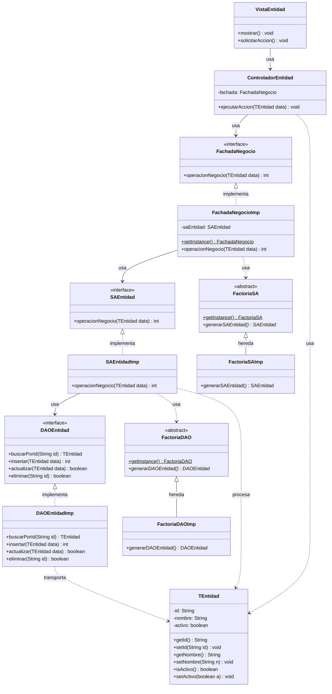
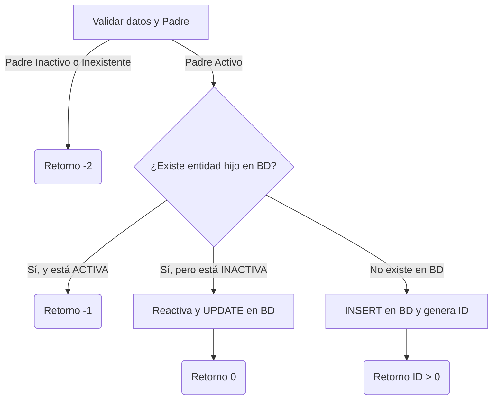

# Guía Definitiva de Arquitectura Multicapa para Exámenes de IS2 (UCM)

Esta guía te proporcionará una metodología estándar y plantillas reutilizables para enfrentarte a **cualquier caso de uso** (Alta, Baja, Modificación, Consulta, etc.) en un examen de Ingeniería de Software II. Está diseñada para garantizar que cumplas estrictamente con todos los patrones de diseño orientados a objetos y la estructura multicapa exigidos por el departamento.

---

## 1. La Arquitectura de Referencia de Tres Capas

En los exámenes de IS2, la arquitectura debe estar estrictamente desacoplada en tres capas. Esta tabla resume la responsabilidad de cada componente y qué componentes puede conocer (y cuáles NO):

| Capa | Componente | Responsabilidad | ¿A quién conoce / invoca? |
| :--- | :--- | :--- | :--- |
| **Presentación** | **Vista** (`VistaXXX`) | Interfaz de usuario (Swing, Consola, Web). Captura datos y muestra resultados. | `ControladorXXX` |
| | **Controlador** (`ControladorXXX`) | Recibe peticiones de la vista, encapsula datos en Transfer Objects (`TXXX`) e invoca a la Fachada. | `FachadaNegocio`, `TXXX` |
| **Negocio** | **Fachada** (`FachadaNegocio` e `Imp`) | **Patrón Facade**. Único punto de entrada a Negocio. Coordina los servicios de aplicación. | `SABusiness`, `FactoriaSA`, `TXXX` |
| | **Abstract Factory SA** (`FactoriaSA` e `Imp`) | Instancia los Servicios de Aplicación correspondientes de forma desacoplada. | `SABusiness` (Interfaz) |
| | **Servicio Aplicación** (`SABusiness` e `Imp`) | **Lógica de negocio y transaccional**. Reglas, validaciones de estado y orquestación de accesos a BD. | `FactoriaDAO`, `DAOBusiness` (Interfaces), `TXXX` |
| | **Transfer Object** (`TXXX`) | **Patrón DTO**. Contenedores de datos estructurados, planos y sin lógica. | Nadie (solo transporta datos) |
| **Integración** | **Abstract Factory DAO** (`FactoriaDAO` e `Imp`) | Instancia los DAOs correspondientes de forma desacoplada. | `DAOBusiness` (Interfaz) |
| | **Data Access Object** (`DAOSub` e `Imp`) | **Acceso a datos**. Ejecuta sentencias SQL (`SELECT`, `INSERT`, `UPDATE`, `DELETE`) en la BD. | `Base de Datos`, `TXXX` |
| | **Base de Datos** (`BD`) | Almacenamiento persistente relacional. | Nadie |

> [!WARNING]
> **REGLA DE ORO DE DESACOPLAMIENTO:**
> * La capa de **Presentación NUNCA puede conocer los SAs o DAOs** directamente. Siempre debe pasar por la `Fachada`.
> * La capa de **Negocio NUNCA puede conocer las implementaciones de los DAOs (`DAOImp`)** o crear instancias directas (`new DAOBebidaImp()`). Siempre debe solicitarlos a través de la interfaz de la `FactoriaDAO`.
> * Las implementaciones de negocio (`SAImp`) **NUNCA realizan consultas SQL directamente**. Eso es responsabilidad exclusiva de los DAOs.

---

## 2. Plantilla del Diagrama de Clases (Estándar CRUD)

Para cualquier ejercicio, el diagrama de clases mantiene la misma topología de dependencias. Solo cambian los nombres de las entidades y operaciones. 

A continuación se muestra el **esqueleto UML estándar** para una entidad hipotética llamada `Entidad` (por ejemplo, `Usuario`, `Reserva`, `Producto`):

---

## 3. Metodología de 4 Pasos para el Diagrama de Secuencia

Para modelar cualquier caso de uso en un único diagrama utilizando fragmentos condicionales (`alt` / `else`), sigue siempre estos 4 pasos cronológicos:

### Paso 1: Inicialización (Presentación $\rightarrow$ Fachada)
El diagrama siempre empieza igual: la Vista recoge los datos, los empaqueta en un Transfer Object (`TXXX`) y llama al Controlador. Este delega en la Fachada, y la Fachada llama al Servicio de Aplicación (`SAImp`).

### Paso 2: Obtención de Recursos (SA $\rightarrow$ Factorías)
El Servicio de Aplicación pide a la `FactoriaDAO` las instancias necesarias de los DAOs (p. ej. `DAOUsuario`, `DAOProducto`). 
*(Truco: No muestres la instanciación de las factorías en sí para evitar ruido visual, simplemente llama directamente a sus métodos estáticos).*

### Paso 3: Consultas de Validación en BD (Capa Integración $\rightarrow$ BD)
El SA realiza validaciones sobre los datos llamando a los métodos de consulta de los DAOs (`buscarPorId`, `buscarPorNombre`). **Aquí debes incorporar al participante de la Base de Datos:** cada llamada del DAO debe disparar una llamada de tipo `SELECT * FROM ...` a la BD, y esta debe devolver el `ResultSet` que luego el DAO transformará en un Transfer Object.

### Paso 4: Bifurcación Lógica con Bloques `alt`
Abre un bloque condicional `alt` basado en los resultados de las validaciones del paso anterior. Cada rama representará un escenario específico de negocio y sus correspondientes operaciones de escritura SQL (`UPDATE`, `INSERT`, `DELETE`) en la BD, cerrando el flujo con el retorno del código o datos correspondientes.

---

## 4. Recetas de Lógica de Negocio para Operaciones Estándar (CRUD)

Dependiendo de la acción que te pida el enunciado del examen, aquí tienes la receta exacta de cómo estructurar la lógica en el Servicio de Aplicación (`SAImp`) y cómo mapearla a sentencias en la Base de Datos.

### Receta 1: ALTA / REGISTRO (Creación de recursos)
* **Objetivo:** Registrar una nueva entidad asegurando la consistencia de datos y evitando duplicados.
* **Flujo Lógico en el SA:**
  1. Validar que los campos obligatorios del Transfer Object no estén vacíos.
  2. Si la entidad depende de otra (p. ej. un Sabor depende de una Bebida):
     * Consultar a la BD si la entidad padre existe y está activa. Si no, **retornar error de inconsistencia** (p. ej., `-2`).
  3. Consultar a la BD si ya existe una entidad con el mismo identificador único o nombre.
     * **Caso A (Ya existe activa):** Retornar código de error por duplicado (p. ej., `-1`).
     * **Caso B (Existe inactiva - Borrado Lógico previo):** Reactivar la entidad (`setActivo(true)`), actualizar sus datos mediante un `UPDATE` en la BD y **retornar éxito por reactivación** (p. ej., `0`).
     * **Caso C (No existe):** Crear la entidad con `activo = true`, guardarla en BD con un `INSERT` (que generará un ID único autoincrementado) y **retornar el ID de la nueva entidad** (p. ej., `idSabor > 0`).

---

### Receta 2: BAJA / ELIMINACIÓN
* **Objetivo:** Dar de baja un elemento, ya sea mediante un borrado lógico (desactivación) o físico (eliminación de la tupla).
* **Flujo Lógico en el SA:**
  1. Consultar en BD si la entidad que se quiere eliminar existe.
     * Si no existe o ya está inactiva, **retornar error de inexistencia** (p. ej., `-1`).
  2. Validar integridad referencial (reglas de negocio):
     * *Ejemplo:* No se puede eliminar una Bebida si tiene Sabores activos asociados.
     * Consultar en BD dependencias activas llamando al DAO secundario. Si hay dependencias, **retornar error de integridad** (p. ej., `-2`).
  3. Ejecución de la baja:
     * **Borrado Lógico (Recomendado en IS2):** Actualizar el estado de la entidad a inactivo (`setActivo(false)`) y llamar a `DAO.actualizar(entidad)` (dispara un `UPDATE ... SET activo = 0 WHERE id = ?`).
     * **Borrado Físico:** Llamar a `DAO.eliminar(id)` (dispara un `DELETE FROM ...`).
  4. Retornar confirmación de éxito (p. ej., `true` o `0`).

---

### Receta 3: MODIFICACIÓN / EDICIÓN
* **Objetivo:** Actualizar ciertos campos de una entidad preexistente sin comprometer las reglas de negocio.
* **Flujo Lógico en el SA:**
  1. Validar que la entidad exista en BD y esté activa mediante `DAO.buscarPorId(id)`.
     * Si no existe o está inactiva, **retornar error** (p. ej., `false` o `-1`).
  2. Validar restricciones de los nuevos campos.
     * *Ejemplo:* Si se modifica el nombre de un Sabor, validar que el nuevo nombre no esté duplicado en la base de datos para esa bebida. Si se duplica, **retornar error**.
  3. Reemplazar los valores modificables del Transfer Object preexistente con los nuevos datos.
  4. Invocar `DAO.actualizar(entidad)` (dispara un `UPDATE Entidad SET campo1 = ?, campo2 = ? WHERE id = ?`).
  5. Retornar confirmación de éxito.

---

### Receta 4: CONSULTA / LISTADO (Lectura de datos)
* **Objetivo:** Recuperar información de la BD en forma de Transfer Objects para mostrársela al usuario.
* **Flujo Lógico en el SA:**
  1. Si la consulta tiene parámetros de filtro (p. ej. filtrar por ID), validar que no sean nulos.
  2. Llamar al DAO correspondiente:
     * Para consulta simple por clave primaria: `DAO.buscarPorId(id)` (dispara `SELECT * FROM ... WHERE id = ?`).
     * Para listados: `DAO.leerTodos()` (dispara `SELECT * FROM ...`).
  3. Si la base de datos no devuelve registros:
     * Si es consulta simple, retornar `null` o lanzar excepción.
     * Si es un listado, retornar una lista vacía `new ArrayList<>()` (evita `NullPointerException` en la capa de presentación).
  4. Retornar el Transfer Object o la lista de Transfer Objects a la Fachada.

---

## 5. Cheat-Sheet para Obtener el 100% de la Nota en el Examen

Si quieres evitar que los correctores te resten décimas en la corrección de diseño, asegúrate de aplicar este check-list de última hora antes de entregar el examen:

* [ ] **¿Has añadido la Base de Datos en el Diagrama de Secuencia?** 
  No termines las flechas del diagrama en los DAOs. Dibuja el participante `BD (SQL)` y muestra los comandos SQL explícitos (`SELECT`, `INSERT`, `UPDATE`) junto a las flechas.
* [ ] **¿Has utilizado la Fachada en todos los flujos?**
  Recuerda que el `Controlador` **nunca** invoca directamente a un `SAImp`. La llamada debe pasar obligatoriamente por la interfaz `FachadaNegocio`.
* [ ] **¿Utilizas Transfer Objects como argumentos?**
  En lugar de diseñar métodos con 5 parámetros individuales en la firma (`crearSabor(String idBebida, String nombre, int kcal, ...)`), empaqueta todo en un `TSabor` y pasa la referencia del objeto: `crearSabor(TSabor sabor)`. Esto puntúa positivamente por aplicar cohesión y diseño orientado a objetos limpio.
* [ ] **¿Has evitado los `new` de implementaciones en la lógica?**
  Asegúrate de que tu `SAImp` obtenga el DAO llamando a `FactoriaDAO.getInstance().generarDAOEntidad()` en lugar de hacer `new DAOEntidadImp()`. Lo mismo aplica para la Fachada y los SAs.
* [ ] **¿Tienes controlado el código de retorno genérico en caso de fallo crítico?**
  Muestra o comenta siempre que la lógica de negocio del `SAImp` se envuelve en un gran bloque `try-catch` para capturar excepciones del sistema o caídas de la base de datos, retornando el código genérico de fallo de la aplicación (generalmente `-2` o `false`).
