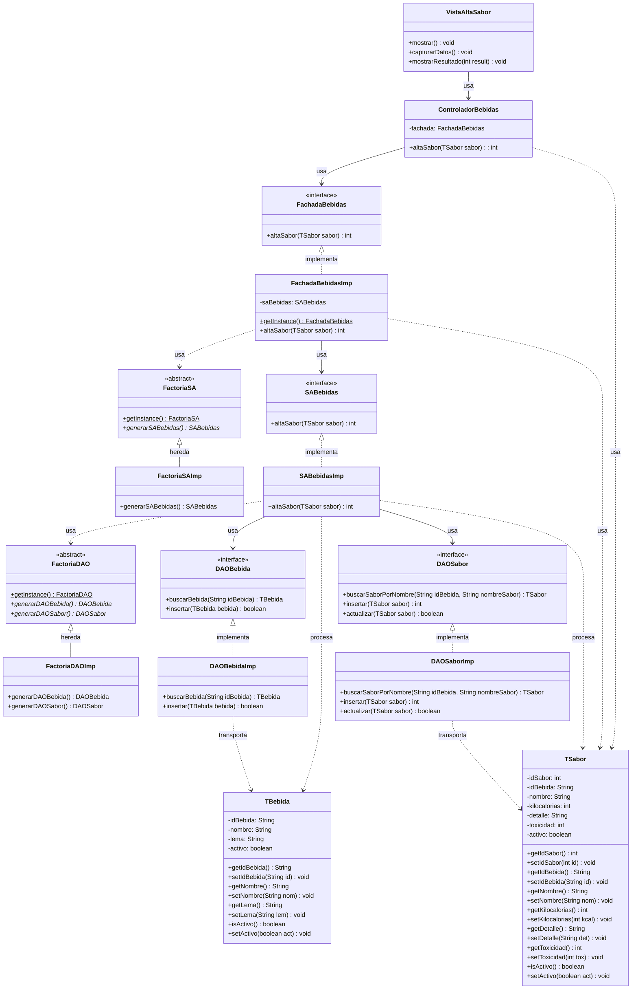
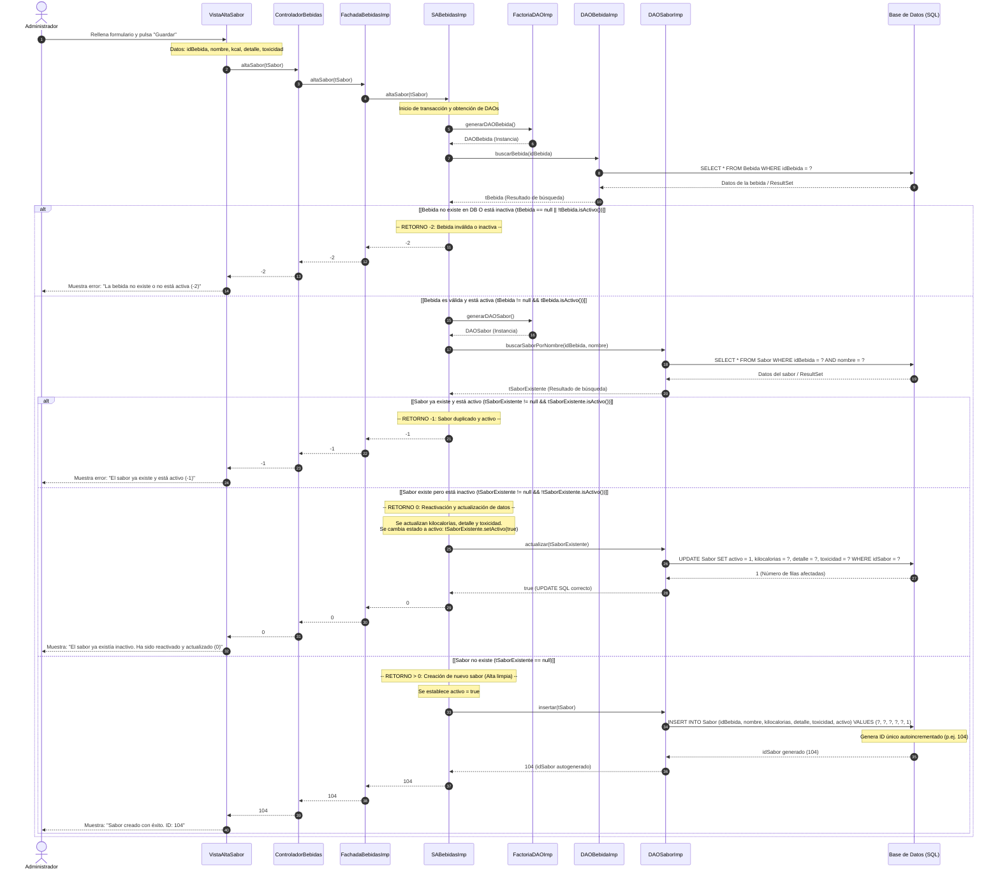

# Solución Examen IS2: Gestión de Bebidas Energéticas
Este documento proporciona la solución completa a los dos ejercicios del examen para el caso de uso **Alta Sabor de Bebida**, aplicando estrictamente los patrones de arquitectura multicapa estudiados en la asignatura (Ingeniería de Software II).

---

## 1. Diagrama de Clases (Ejercicio 1)

El diseño arquitectónico sigue el patrón de diseño clásico de tres capas (Presentación, Negocio e Integración) requerido en el proyecto. 

### Patrones de Diseño Aplicados
1. **Multicapa (Multitier)**: Desacoplamiento total de responsabilidades.
2. **Fachada (Facade)** (`FachadaBebidas`): Punto de entrada único a la capa de Negocio desde la capa de Presentación. Evita dependencias directas con los servicios de aplicación.
3. **Application Service / Servicio de Aplicación** (`SABebidas`): Contiene la lógica transaccional y las reglas de negocio del caso de uso.
4. **Transfer Object (DTO)** (`TBebida`, `TSabor`): Estructuras de datos ligeras, serializables y sin comportamiento para transportar datos entre capas.
5. **Abstract Factory** (`FactoriaSA`, `FactoriaDAO`): Creación desacoplada de las implementaciones de la lógica de negocio y de integración.
6. **Data Access Object (DAO)** (`DAOBebida`, `DAOSabor`): Encapsulan el acceso a la base de datos física (SQL/JDBC).

### Diagrama de Clases UML (Mermaid)

---

## 2. Diagrama de Secuencia Único (Ejercicio 2)

A continuación, se detalla el flujo completo de interacciones del caso de uso **Alta Sabor de Bebida** en un **único diagrama de secuencia**. 

Para representar todos los posibles flujos y códigos de retorno (`> 0`, `0`, `-1`, `-2`) en un solo modelo, se utilizan fragmentos condicionales **`alt` / `else`** de UML (representados mediante bloques `alt` en Mermaid), permitiendo visualizar claramente las bifurcaciones de la lógica de negocio.

### Diagrama de Secuencia Unificado (Mermaid)

---

> [!TIP]
> **Detalle clave de Implementación (Control de Excepciones para Retorno -2):**
> Para garantizar que el sistema siempre devuelva `-2` ante cualquier error inesperado de base de datos (p. ej. fallo de conexión JDBC, caída del servidor, violación inesperada de claves foráneas), toda la lógica dentro de `SABebidasImp.altaSabor` debe estar envuelta en un bloque `try-catch (Exception e)`. Si se produce una excepción, esta es capturada en el catch, se registra el error (log) y se devuelve `-2` de forma limpia y controlada a las capas superiores.

